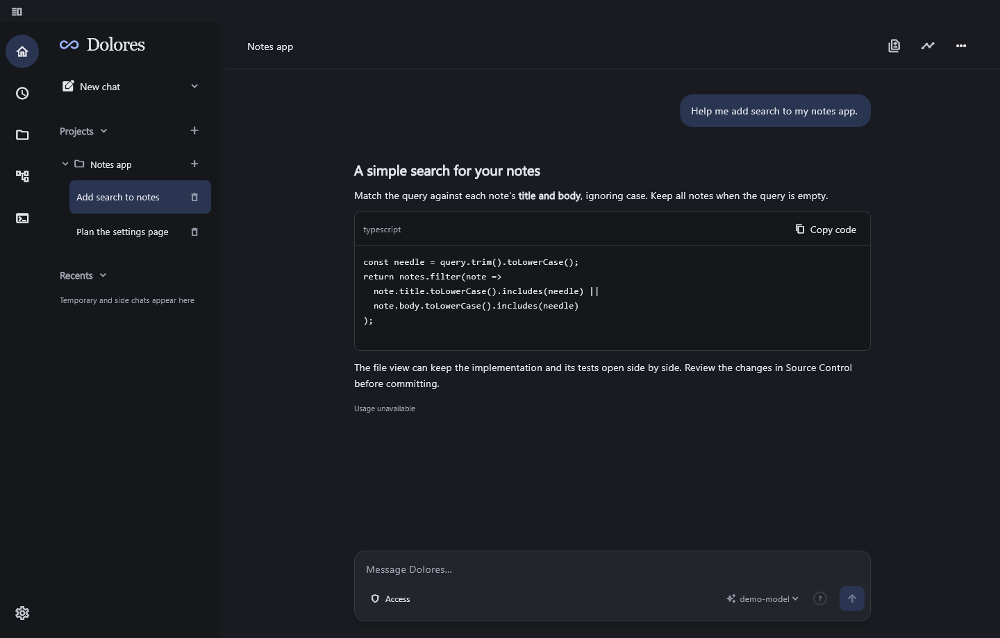
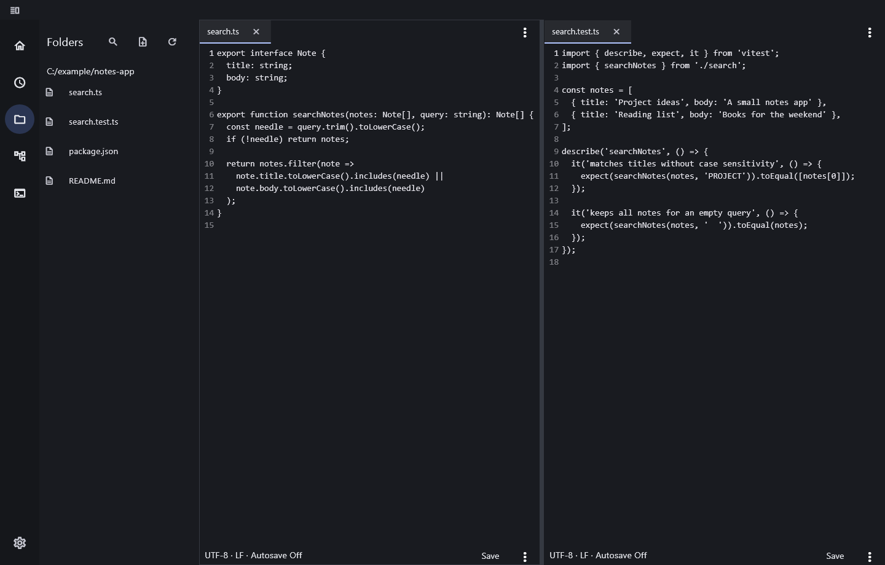
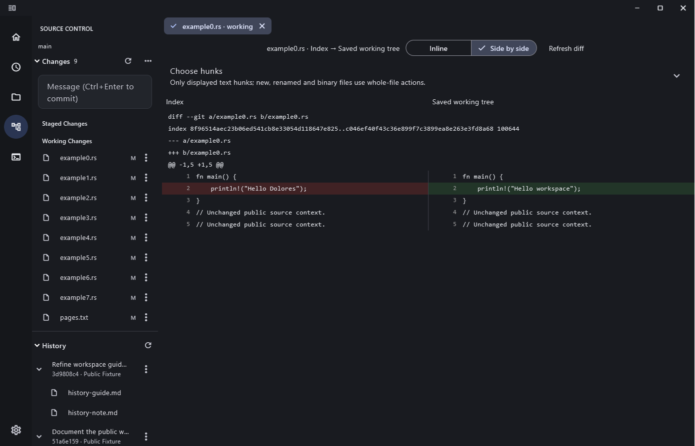
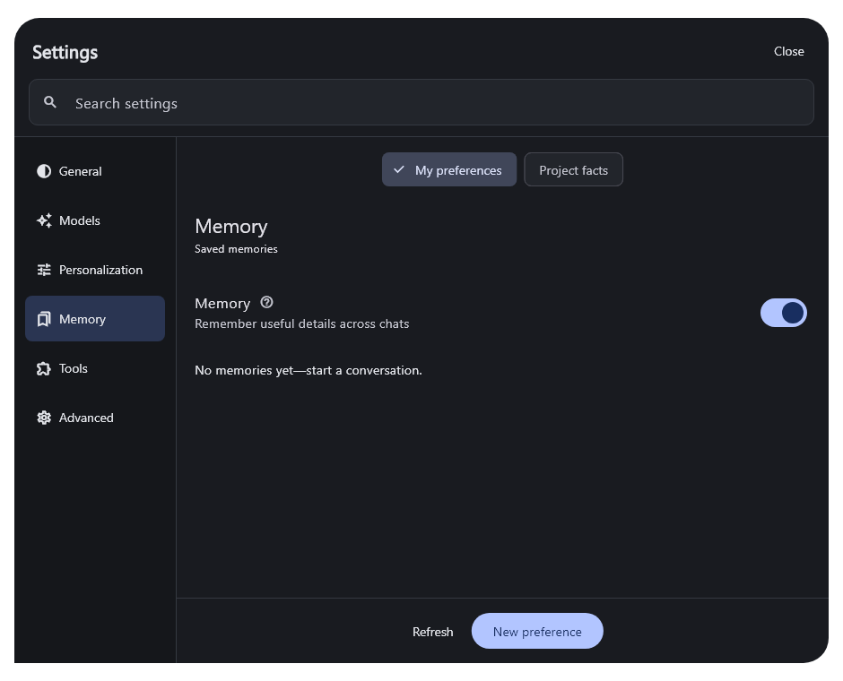

# Dolores

[English](README.md) · [简体中文](README_zh.md)

**An AI assistant for your projects, with chat, files, Git and a terminal in one desktop app.**

Dolores helps you understand code, make changes and work through everyday tasks using your choice of local or hosted model. Pick a project, describe what you need, and review the proposed edits and commands. Useful memories, reusable skills and scheduled tasks help carry work forward across conversations.

The name comes from Dolores in *Westworld*: continuity, curiosity and learning from experience are the inspiration.

*Project conversations and code replies in the Home view. All screenshots use synthetic demonstration data.*

## What you can do

- **Work through chat.** Stream replies, attach files or images, inspect context, resume work and delegate scoped tasks to subagents.
- **Edit your project.** Browse folders, drag file tabs between split views, find text and save changes with draft recovery.
- **Use Git without leaving the app.** Browse commits, open file diffs, stage changes and review commit, branch, stash and remote actions.
- **Open a terminal.** Use tabs and split views, starting in the selected project's folder or your home directory.
- **Remember useful details.** Enable automatic memory for preferences and project facts, then inspect, correct or forget what was saved.
- **Schedule work in conversation.** Ask for a recurring task and manage its status, results and errors on the Scheduled page. Optional background mode keeps tasks running in the Windows tray while the main window is closed.
- **Extend your assistant.** Use reusable skills, installed local MCP servers, web search, an optional browser and reviewed Windows computer interaction.

*Browse your project and keep the implementation and tests open side by side.*

*Expandable commit history and side-by-side Git diffs.*

*Memory is optional. Saved preferences and project facts can be inspected and removed.*

## Get started

Dolores is an **early preview for Windows x64**. Releases are portable ZIPs; signing and other platforms remain future work. See the [tested scope and remaining gaps](docs/ACCEPTANCE.md).

1. Extract the **entire** Windows ZIP and open `Start-Dolores.cmd`. The launcher checks for missing files and the [Microsoft Visual C++ x64 runtime](https://learn.microsoft.com/en-us/cpp/windows/latest-supported-vc-redist?view=msvc-170). Keep the DLLs and `data/` folder together.
2. Open **Settings → Models**, add an OpenAI-compatible API URL and key, then fetch and enable models. Manual model IDs are supported when listing is unavailable.
3. Open a project, create a temporary workspace, or start a side chat. Select a model in the input box and describe your task.

Working chats require a model that supports Chat Completions function calls. Image input requires an explicitly configured image-capable model. Dolores connects to a model service you provide; it does not bundle or start one.

For setup, controls and recovery, see the [user guide](docs/USER_GUIDE.md). To build from source, see [CONTRIBUTING.md](CONTRIBUTING.md).

## Your data and control

Conversations, settings and memories are stored locally. Content included in a request is sent to your configured model provider. Remembered API keys use the OS credential vault; without **Remember connection**, the key lasts only for the current launch.

File tools stay within the working folder. Commands and MCP servers run with your account's permissions; review prompts are not OS sandboxing. Memory, companionship and background scheduling are optional. [Data handling and privacy](docs/PRIVACY.md) explains the boundaries.

## Development

Dolores uses **Flutter** for the desktop interface and a **Rust** core with replaceable provider, storage, credential and tool interfaces. Windows GitHub Actions check the project and package an unsigned portable ZIP; matching version tags prepare a draft release.

- [Contribute](CONTRIBUTING.md) — build, test and packaging instructions.
- [Changelog](CHANGELOG.md) · [Release procedure](docs/RELEASING.md).
- [Architecture](docs/ARCHITECTURE.md) · [Roadmap](docs/ROADMAP.md) · [Documentation](docs/README.md).

Licensed under [MIT](LICENSE).
