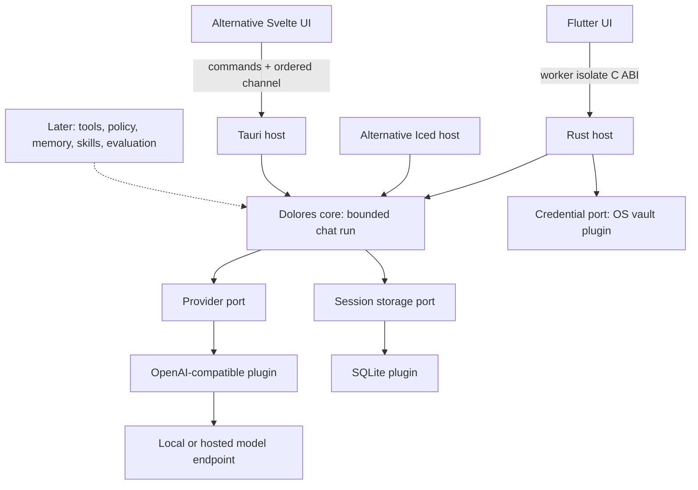

# Dolores architecture

Status: Flutter selected by the user on 2026-10-01 after the working visual/resource comparison. Iced and Tauri remain available as alternatives. Platform, accessibility and low-end release acceptance remain open.

Flutter 3.47.5 widgets call a bundled Rust library through a small C ABI on a worker isolate; no sidecar/server is added. Rust networking remains asynchronous and bounded. Brick 2.1 adds remembered connections through a separate OS credential plugin, restart restoration and retry/forget controls. See [the bridge contract](flutter/flutter-api.md) and [build instructions](../apps/dolores_flutter/README.md).

Dolores is a local desktop agent harness. Its long-term purpose is to improve through remembered preferences, reviewed reusable skills, and evaluation of outcomes. It does not claim consciousness or automatic model training.

## Decisions

| Concern | Choice | Reason and cost |
| --- | --- | --- |
| Desktop shell | Flutter 3.47.5 + bundled Rust C ABI | Selected for visual refinement and widget flexibility; measured memory exceeds Iced and the provisional target. Alternatives remain available. |
| Runtime | Rust + Tokio | Bounded queues, explicit ownership, asynchronous networking; native builds need platform tooling. |
| UI | Flutter widgets + semantic palette | System theme, selectable text, responsive drawer, worker-isolate calls; real input/accessibility checks remain open. |
| Persistence | SQLite via a storage plugin | Transactional local history, no database service; synchronous small operations run away from the UI thread. |
| Credentials | OS vault via a credentials plugin | Explicit native backends; no plaintext fallback. Nonsecret references are transactional in SQLite, with best-effort cross-store cleanup. |
| Models | OpenAI-compatible provider plugin | Local or hosted endpoints through one adapter; compatibility is tested against the chat-completions subset, not assumed for every vendor. |
| Extensions | Typed Rust interfaces and explicit built-in registration | Start with replaceable provider/storage plugins. External executable/WASM plugins require a later protocol and permission design. |
| Learning | Reviewed memories and skills, then outcome evaluation | Learn reusable behavior without silently rewriting instructions or running generated code. Not implemented in brick 1. |

The core has no desktop framework, UI, HTTP, SQLite or keyring dependency. Each host assembles plugins. Networking belongs to the provider plugin. Flutter remembers secrets only in OS secure storage when requested; alternative hosts retain memory-only keys. All share `dev.dolores.desktop` and the database format; `DOLORES_DATA_DIR` selects an isolated absolute directory. History is unencrypted. Concurrent runs from separate hosts are outside the per-host guard's boundary.

## Boundaries and lifecycle

`ModelProvider` streams text through a bounded channel and honors cancellation. Optional discovery and model-switching methods default to unsupported for other plugins; the OpenAI-compatible plugin lists bounded IDs and clones its client/key for model changes. `SessionStore` owns history and atomically saves complete turns and nonsecret connection metadata. `CredentialStore` reads/writes/deletes secrets using opaque IDs. Existing stores may decline the new connection capability through default methods. `PluginDescriptor` records ID, kind and API version; trusted built-ins are explicitly registered. There is no dynamic plugin loader or installation UI yet.

Run lifecycle: idle → validate → load bounded context → stream → atomically commit → idle. Errors/cancellation discard the uncommitted turn and restore the draft. One run is allowed per host; session mutation/configuration are excluded while it runs. Iced reserves a monotonically numbered run before scheduling work; Stop works before networking, and stale events cannot finish a newer run. Tauri uses UUIDs and a reservation acknowledgement. Completion wins over Stop after the atomic save starts. Shutdown drops the run and credential.

Third-party native code is not sandboxed by these interfaces. Tauri capabilities control access from the webview to commands, not native plugin behavior. Any later external plugin requires API version negotiation, explicit activation, declared capabilities, cancellation, resource budgets, and an accurately described isolation boundary.

## Resource policy

- No resident local model, Python runtime, Node sidecar, vector database, background scheduler, idle polling, telemetry, or automatic downloads in the app.
- Flutter's Rust host uses two async workers and at most two blocking workers. A Dart worker serializes storage and native calls. Polling runs only during generation; there is no application idle timer. Scrolling, startup, GPU/system memory and low-end responsiveness need separate checks.
- One active generation, a 32-item text queue, a maximum 1 MiB SSE frame, a maximum 128 KiB answer, a fixed 10-second connect timeout and a configurable whole-provider-response deadline (default 180 seconds, range 1–900).
- User messages up to 16 KiB, newest 40 complete turns, and at most 128 KiB of request context. The byte budget is not a tokenizer or a guarantee of fitting every model's context window.
- Flutter replaces bounded pages of 50 sessions/80 messages and exports complete saved history. Context always uses the latest saved complete turns, independently of the viewed page.
- Endpoint redirects are disabled. HTTPS is required except HTTP loopback for local servers. Endpoint requests occur only when the user fetches models or sends a message.

Initial release targets, **not measured claims**: idle app process-tree working set ≤150 MiB, cold interactive startup ≤2 seconds, and responsive cancellation on a 2-core/4 GiB reference machine. Measure release builds with all webview subprocesses, record OS/hardware and sample method, and revise targets from evidence. Local-model memory is a separate budget.

The paired Flutter trial measured 224.36 MiB working set / 229.52 MiB private bytes, versus Tauri 427.47 / 197.71 and Iced 29.60 / 13.81. Flutter exceeds the original working-set target and has higher private allocation than Tauri. Choosing it does not establish low-end acceptance or change that target silently. Representative hardware, startup and sustained interaction remain open. See [acceptance](ACCEPTANCE.md).

## Sources

See [native research](research/native-shell-options.md) for rendering, APIs, IME and accessibility evidence. [Tauri architecture](https://v2.tauri.app/concept/architecture/) and [capabilities](https://v2.tauri.app/security/capabilities/) inform the alternative host. [Initial research](research/architecture-options.md) records the Hermes/DeepSeek influences.

Brick 2.3.2 adds optional provider-reported usage and storage metadata capabilities with defaults for existing plugins. Flutter saves usage, original model and exact context summary atomically with completed replies. An on-demand context preview reads one SQLite snapshot and adds no idle work or provider request. The core byte/turn bounds remain unchanged and are not model-specific token budgets.

Brick 2.4 adds validated nonsecret request settings through optional core ports. SQLite persists them separately from connection/credentials; Flutter's connection manager creates a replacement provider before save and activates it only after successful storage. The provider reports the actual immutable limits used for each run. A single deadline includes headers, body, queue waits and the bounded usage-compatibility attempt; local history reads and final persistence stay outside it. Manual recovery is local fixed guidance; no automatic failure retry or idle work is introduced. Alternative shells retain constructor defaults.
