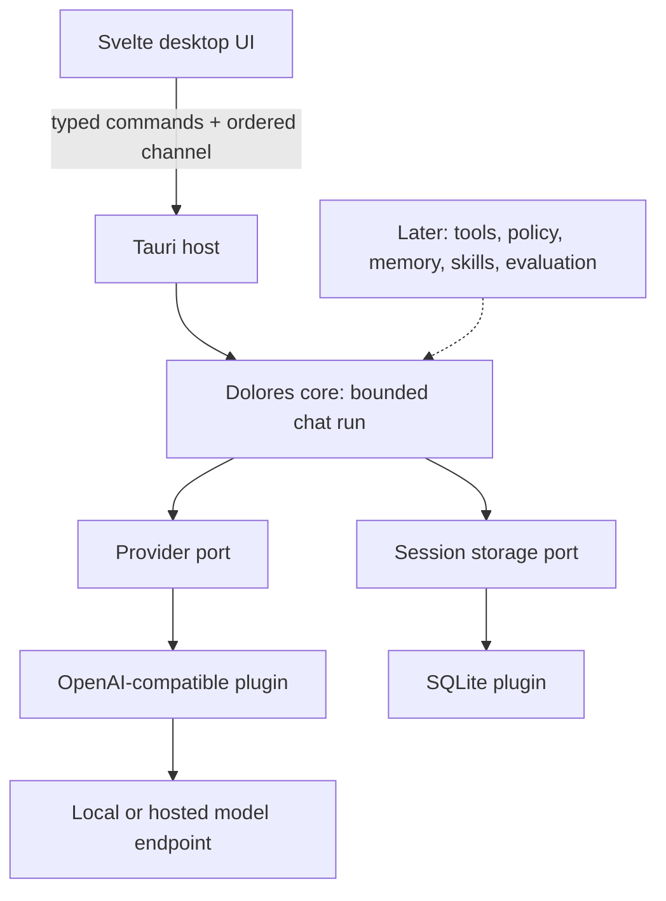

# Dolores architecture

Status: provisional desktop-shell decision, 2026-10-01. The first Windows release build is functional, but measured idle memory misses the initial budget. Compare a native Rust UI before finalizing the shell; the reusable core/plugin boundaries remain the foundation.

Dolores is a local desktop agent harness. Its long-term purpose is to improve through remembered preferences, reviewed reusable skills, and evaluation of outcomes. It does not claim consciousness or automatic model training.

## Decisions

| Concern | Choice | Reason and cost |
| --- | --- | --- |
| Desktop shell | Tauri 2 | Uses the system webview instead of shipping Chromium; different operating systems need separate testing. |
| Runtime | Rust + Tokio | Bounded queues, explicit ownership, asynchronous networking; native builds need platform tooling. |
| UI | Svelte 5 + TypeScript + Vite | Small component model and compiled UI; avoid a component framework initially. |
| Persistence | SQLite via a storage plugin | Transactional local history, no database service; synchronous small operations run away from the UI thread. |
| Models | OpenAI-compatible provider plugin | Local or hosted endpoints through one adapter; compatibility is tested against the chat-completions subset, not assumed for every vendor. |
| Extensions | Typed Rust interfaces and explicit built-in registration | Start with replaceable provider/storage plugins. External executable/WASM plugins require a later protocol and permission design. |
| Learning | Reviewed memories and skills, then outcome evaluation | Learn reusable behavior without silently rewriting instructions or running generated code. Not implemented in brick 1. |

The core has no Tauri, UI, HTTP, or SQLite dependency. The host assembles plugins and exposes the desktop commands. UI components do not call model endpoints directly. Provider secrets remain in the native process for the application session and are never persisted. Endpoint/model preferences and chat contents are saved in the application data directory; chat history is unencrypted in this first brick.

## Boundaries and lifecycle

`ModelProvider` streams text through a bounded channel and honors cancellation. `SessionStore` owns session CRUD and atomically commits a complete user/assistant turn. `PluginDescriptor` records ID, kind and API version; the host registers trusted built-ins explicitly. These are Dolores extension points, distinct from Tauri's own plugins. The current host chooses the installed provider and store at compile time. There is no dynamic plugin loader or installation UI yet.

Run lifecycle: idle → validate → load bounded context → stream → atomically commit → idle. Error/cancellation discards the uncommitted turn, with the draft retained by the UI. One foreground run is allowed per host. Every run has a caller-generated ID, so stopping an old run cannot stop a new one. App shutdown drops the run and session credential.

Third-party native code is not sandboxed by these interfaces. Tauri capabilities control access from the webview to commands, not native plugin behavior. Any later external plugin requires API version negotiation, explicit activation, declared capabilities, cancellation, resource budgets, and an accurately described isolation boundary.

## Resource policy

- No resident local model, Python runtime, Node sidecar, vector database, background scheduler, polling, telemetry, or automatic downloads in the app.
- One active generation, a 32-item text queue, a maximum 1 MiB SSE frame, a maximum 128 KiB answer, a 10-second connect timeout and a 180-second request timeout.
- User messages up to 16 KiB, newest 40 complete turns, and at most 128 KiB of request context. The byte budget is not a tokenizer or a guarantee of fitting every model's context window.
- Session lists are capped at 100 and the first UI has no history pagination. SQLite keeps earlier history; the roadmap adds browsing/pagination.
- Endpoint redirects are disabled. HTTPS is required except HTTP loopback for local servers. No endpoint requests occur before the user sends a message.

Initial release targets, **not measured claims**: idle app process-tree working set ≤150 MiB, cold interactive startup ≤2 seconds, and responsive cancellation on a 2-core/4 GiB reference machine. Measure release builds with all webview subprocesses, record OS/hardware and sample method, and revise targets from evidence. Local-model memory is a separate budget.

First normal Windows release observation: 421.80 MiB summed working set and 189.34 MiB private bytes on a 32-GiB machine. The working-set target is **not achieved**. A single warm, instrumented startup reached UI readiness in 1.3914 seconds; cold/low-end acceptance is still open. See [acceptance](ACCEPTANCE.md) for methodology and limitations. The next iteration must compare a native UI shell before expanding features.

## Sources

The [official Tauri architecture](https://v2.tauri.app/concept/architecture/), [channel documentation](https://v2.tauri.app/develop/calling-rust/), and [capabilities documentation](https://v2.tauri.app/security/capabilities/) inform the desktop boundary. [Svelte documentation](https://svelte.dev/docs/svelte/overview) informs the frontend choice. See [the research comparison](research/architecture-options.md) for alternatives and the Hermes/DeepSeek influences.
