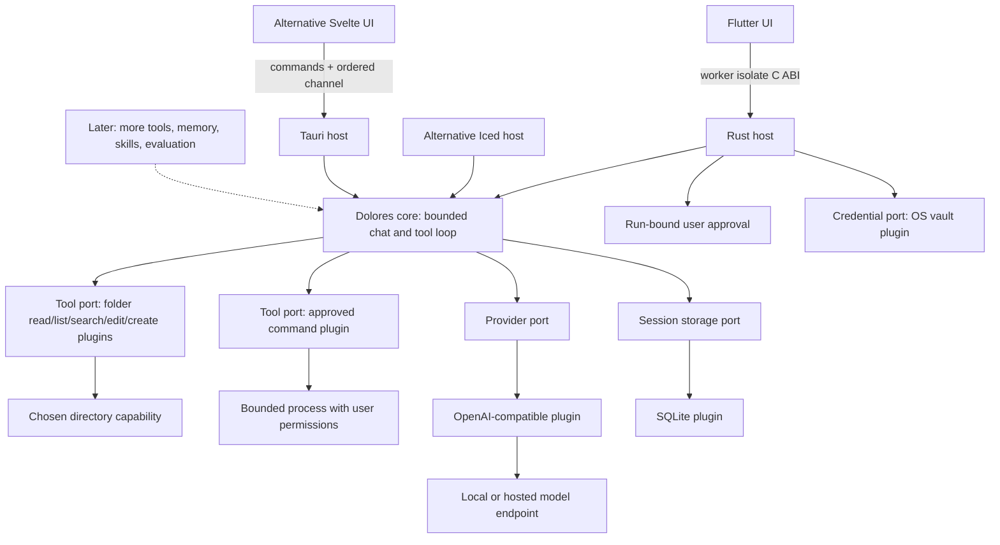

# Dolores architecture

Task feedback uses a small core contract and a revisioned SQLite row bound to the exact assistant reply. It is read alongside paged/exported history but excluded from model context and learning. Schema 18 adds a cascading feedback table without rewriting original turns, model/settings or tool receipts; failures preserve corrections for explicit recovery. The Flutter inspector shares existing theme/layout and executes local persistence on the bridge worker.

Brick 6.8 separates proposal matching into the file plugin's edit_text module. It adapts only LF/CRLF proposal breaks to a uniform source style before unique exact matching and bounded diff generation. Mixed/lone-CR sources retain byte-exact semantics with explicit mismatch recovery. Prepared plans, raw snapshot checks, journal and revert remain unchanged. The schema/spec shape and all budgets stay fixed; there is no dependency, worker or fuzzy match. See [exact-edit design](design/reliable-exact-edits.md).

Brick 6.7 classifies command receipts from exit/capture evidence in the core, and adds a commandReview pause for unresolved failures. The Flutter host reconciles prior continuation receipts with new results by exact program/arguments before its existing atomic commit. Complete successful reruns clear the corresponding failure; unrelated commands and model prose do not. Initial budget guidance participates in context preview/trimming/accounting and updates in place per call. Repair reuses the existing bounded latest-message protocol and fresh approvals. No dependency, migration, worker or loop-default change is added. See [validation/repair design](design/coding-validation-repair.md).

Brick 6.6 adds endpoint/model generation profiles in SQLite schema 17 without rewriting existing settings or history. The Flutter settings dialog selects a profile independently of the active chat. Provider construction, context preview and continuation use effective settings; bounded structured consumers retain smaller caps and explicit draft overrides. Reasoning is a typed optional adapter, omitted for legacy/default settings. OpenAI effort uses max_completion_tokens; DeepSeek off sends its documented thinking toggle. Named control rejection has sanitized manual recovery, with no settings fallback or retry. Complete DeepSeek thinking-history replay remains unsupported. No dependency or resident process is added. See [profile design](design/model-generation-profiles.md).

Brick 6.5 applies a shared per-tool argument budget: 64 KiB for creation/editing, 4 KiB for other tools. Stream assembly permits bounded name fragmentation, then validates against the complete name; file/diff review caps remain 16 KiB. Coding guidance encourages runnable slices and actual validation. Windows child processes receive conventional drive/UNC cwd spelling while canonical folder identity stays unchanged; a relative Node script/import regression verifies the distinction. Existing supervision, approvals, journal and request limits remain. No dependency, schema change, resident process or automatic task planner is added. See [larger coding-file design](design/larger-code-files.md).

Brick 6.4 adds explicit paused-task outcomes for the selected Flutter host. Provider `length` and agent step exhaustion retain partial text, usage, model steps and completed tool receipts in optional existing `turn_metadata` JSON. `stream_chat_outcome` has a compatibility default; structured skill/memory consumers retain strict truncation errors. Continue binds the latest saved assistant ID at start, execution and the atomic SQLite commit, then appends a separate bounded turn with current context/settings and fresh approvals. Saved receipts are untrusted model data, never executable calls or reusable permissions. A 96-KiB recovery prompt and 16-receipt preflight cap coexist with ordinary byte/token context guards. Automatic learning skips paused replies. No dependency, schema change, background worker or automatic retry is added; SQLite remains schema 16. Stop, transport errors and malformed responses still fail without a partial chat commit. See [recovery design](design/long-task-recovery.md).

Brick 6.3 supports four reviewed local MCP connections per working folder, with two shared active external tool slots and on-demand processes. Stable UUID identities separate aliases, approvals and credentials; legacy aliases and vault records remain compatible. SQLite schema 16 atomically migrates the former root-keyed MCP table to `(root,id)` without rewriting configuration JSON or other tables. Capacity refusal preserves the review and credentials; disabling a sibling frees slots without consuming that review. No runtime dependency or resident server is added.

Brick 6.2 adds explicit MCP credential bindings through the existing `CredentialStore`. Ephemeral values travel from masked Flutter fields to inspection, then the OS vault on Enable; SQLite holds names, opaque UUIDs and bounded retirement references. Approved invocation resolves keys only after freshness/approval checks and passes them to the reviewed child environment. Metadata echoes are refused and text-result echoes redacted. Disable retains keys; Forget disables first and preserves references on cleanup failure. No new dependency, schema migration, resident server or worker is added. See [MCP credential design](design/mcp-connection.md#explicit-credentials-brick-62).

Brick 3.8 adds `dolores-tools-command` as a separately compiled tool plugin registered only by the selected Flutter host. It resolves an installed executable, binds literal arguments to one local approval, then runs with closed stdin and a filtered environment. A blocking task and two bounded pipe readers exist only during execution; output/time and cancellation cleanup are explicit. Commands have user-account permissions, not folder confinement, and their effects are outside the file-change journal. Windows uses suspended creation followed by Job assignment before execution; Unix uses process groups, with platform acceptance still open. Schema 8 is unchanged. See [command design](design/approved-commands.md).

Brick 3.5 adds a compiled single-file edit plugin to the selected shell's existing folder registry. Bounded local plans bind the snapshot/diff to one approval, then stage and atomically replace through the held parent directory capability. Changed-byte/permission checks are optimistic. File effects are independent of conversation persistence; this brick has no rollback or durable failed-run journal. It reuses the existing blocking pool and introduces no dependency or migration. See [design](design/approved-edits.md).

Status: Flutter selected by the user on 2026-10-01 after the working visual/resource comparison. Iced and Tauri remain available as alternatives. Platform, accessibility and low-end release acceptance remain open.

Flutter 3.47.5 widgets call a bundled Rust library through a small C ABI on a worker isolate; no sidecar/server is added. Rust networking remains asynchronous and bounded. Brick 2.1 adds remembered connections through a separate OS credential plugin, restart restoration and retry/forget controls. See [the bridge contract](flutter/flutter-api.md) and [build instructions](../apps/dolores_flutter/README.md).

Dolores is a local desktop agent harness. Its long-term purpose is to improve through remembered preferences, reviewed reusable skills, and evaluation of outcomes. It does not claim consciousness or automatic model training.

## Decisions

Brick 3.4 adds an optional streaming-tool provider method with a legacy default. Core forwards bounded public text by call number and saves intermediate commentary in completed metadata. The OpenAI adapter assembles indexed tool deltas behind the provider boundary; only complete validated calls enter approval. Bounded-channel delivery is included in deadlines. No migration/dependency/worker is added. See [design](design/streaming-agent.md).

| Concern | Choice | Reason and cost |
| --- | --- | --- |
| Desktop shell | Flutter 3.47.5 + bundled Rust C ABI | Selected for visual refinement and widget flexibility; measured memory exceeds Iced and the provisional target. Alternatives remain available. |
| Runtime | Rust + Tokio | Bounded queues, explicit ownership, asynchronous networking; native builds need platform tooling. |
| UI | Flutter widgets + semantic palette | System theme, selectable text, responsive drawer, worker-isolate calls; real input/accessibility checks remain open. |
| Persistence | SQLite via a storage plugin | Transactional local history, no database service; synchronous small operations run away from the UI thread. |
| Credentials | OS vault via a credentials plugin | Explicit native backends; no plaintext fallback. Nonsecret references are transactional in SQLite, with best-effort cross-store cleanup. |
| Models | OpenAI-compatible provider plugin | Local or hosted endpoints through one adapter; compatibility is tested against the chat-completions subset, not assumed for every vendor. |
| Folder tools | Compiled folder plugins, saved working-directory capability and per-operation approval | Bounded reads/listing/search and reviewed exact edits, explicit results/diffs; native plugin code remains trusted. |
| Folder discovery | Approved shallow listing and bounded literal text search | Shared directory capability, separate query/scope decisions and partial results; no index or background scanning. |
| Command tools | Separate compiled plugin, reviewed direct executable and literal arguments | Working directory plus user permissions; 30-second/8-KiB bounds and active process cleanup, no sandbox or automatic change journal. |
| Extensions | Typed Rust ports plus reviewed local MCP tools | `dolores-tools-mcp` adapts selected stdio server tools into the existing approval loop; external processes have user permissions and bounded supervised lifetime. Remote/WASM and persistent connections remain future scope. |
| Learning | Reviewed memories and skills, then outcome evaluation | Learn reusable behavior without silently rewriting instructions or running generated code. Not implemented in brick 1. |

Brick 3.2 explicitly registers listing, search and read plugins sharing the selected directory handle. Search/listing add optional query provenance and a completed status to extensible tool records; old records and schema 5 remain compatible. Their scan/result budgets and exclusions live in the filesystem plugin, while the core owns distinct `(tool,target,query)` denial decisions and the existing run budget. Flutter discloses scan scope before approval and displays selectable results with partial coverage. No service, index, dependency or worker is added. See [folder discovery](design/folder-discovery.md).

The core has no desktop framework, UI, HTTP, SQLite or keyring dependency. Each host assembles plugins. Networking belongs to the provider plugin. Flutter remembers secrets only in OS secure storage when requested; alternative hosts retain memory-only keys. All share `dev.dolores.desktop` and the database format; `DOLORES_DATA_DIR` selects an isolated absolute directory. History is unencrypted. Concurrent runs from separate hosts are outside the per-host guard's boundary.

Brick 6.1 registers selected local MCP tools only in the Flutter host's working-chat registry. `dolores-tools-mcp` reuses the command plugin's supervised process transport with writable stdin, negotiates the protocol, discovers bounded object schemas and binds each call to its exact approval. A server starts only for explicit inspection or approved invocation and stops afterward. Revisioned folder configuration began in an additive schema-15 table and uses a composite root/connection key since schema 16; no server or runtime is bundled. SHA-256 checks reviewed launch files and the call rechecks selected metadata before invocation. External processes are trusted user-permission programs, not sandboxed folder capabilities. See [MCP design](design/mcp-connection.md).

## Boundaries and lifecycle

`ModelProvider` streams text through a bounded channel and honors cancellation. Optional discovery and model-switching methods default to unsupported for other plugins; the OpenAI-compatible plugin lists bounded IDs and clones its client/key for model changes. `SessionStore` owns history and atomically saves complete turns and nonsecret connection metadata. `CredentialStore` reads/writes/deletes secrets using opaque IDs. Existing stores may decline the new connection capability through default methods. `PluginDescriptor` records ID, kind and API version; trusted built-ins are explicitly registered. There is no dynamic plugin loader or installation UI yet.

Run lifecycle: idle → validate → load bounded context → stream → atomically commit → idle. Errors/cancellation discard the uncommitted turn and restore the draft. One run is allowed per host; session mutation/configuration are excluded while it runs. Iced reserves a monotonically numbered run before scheduling work; Stop works before networking, and stale events cannot finish a newer run. Tauri uses UUIDs and a reservation acknowledgement. Completion wins over Stop after the atomic save starts. Shutdown drops the run and credential.

Third-party native code is not sandboxed by these interfaces. Tauri capabilities control access from the webview to commands, not native plugin behavior. Any later external plugin requires API version negotiation, explicit activation, declared capabilities, cancellation, resource budgets, and an accurately described isolation boundary.

## Resource policy

Brick 3.3 replaces Flutter's launch-wide tools toggle with typed `SessionWorkspace`/`WorkspaceKind` and optional storage ports. SQLite schema 6 atomically stores immutable per-chat folder associations and a bounded recent-project list. The host validates project folders or creates unique app-managed temporary folders; side/legacy chats have no folder. Each run obtains tools from its saved association, never the last visited chat. Folder paths are private host state and are excluded from automatic provider context and exports. Conversation deletion preserves all working files. Initial temporary-folder creation is lazy, and no index, cleanup scheduler or idle polling is added. See [working sessions](design/working-sessions.md); this supersedes the launch-only scope in the historical brick 3.1 decision.

- No resident local model, Python runtime, Node sidecar, vector database, background scheduler, idle polling, telemetry, or automatic downloads in the app.
- Flutter's Rust host uses two async workers and at most two blocking workers. A Dart worker serializes storage and native calls. Command execution occupies a blocking task plus two bounded pipe reader threads until cleanup; its subprocess resource usage is not capped by harness memory targets. Polling runs only during generation; there is no application idle timer. Scrolling, startup, GPU/system memory and low-end responsiveness need separate checks.
- One active generation, a 32-item text queue, a maximum 1 MiB SSE frame, a maximum 128 KiB answer, a fixed 10-second connect timeout and a configurable whole-provider-response deadline (default 180 seconds, range 1–900).
- User messages up to 16 KiB, newest 40 complete turns, and at most 128 KiB of request context. The byte budget is not a tokenizer or a guarantee of fitting every model's context window.
- Flutter replaces bounded pages of 50 sessions/80 messages and exports complete saved history. Context always uses the latest saved complete turns, independently of the viewed page.
- Endpoint redirects are disabled. HTTPS is required except HTTP loopback for local servers. Endpoint requests occur only when the user fetches models or sends a message.

Initial release targets, **not measured claims**: idle app process-tree working set ≤150 MiB, cold interactive startup ≤2 seconds, and responsive cancellation on a 2-core/4 GiB reference machine. Measure release builds with all webview subprocesses, record OS/hardware and sample method, and revise targets from evidence. Local-model memory is a separate budget.

The paired Flutter trial measured 224.36 MiB working set / 229.52 MiB private bytes, versus Tauri 427.47 / 197.71 and Iced 29.60 / 13.81. Flutter exceeds the original working-set target and has higher private allocation than Tauri. Choosing it does not establish low-end acceptance or change that target silently. Representative hardware, startup and sustained interaction remain open. See [acceptance](ACCEPTANCE.md).

## Sources

Brick 7 adds local evidence through optional store ports: revisioned exact-reply feedback (schema 18) and bounded frozen context comparisons (schema 19). Comparison workers reuse the provider/profile ports without tools, persist each response before the next, and keep immutable request/result prefixes. Failures preserve durable or explicitly volatile evidence. Exports keep assessments/comparisons separate from provider-visible history. See [comparison design](design/context-comparisons.md).

See [native research](research/native-shell-options.md) for rendering, APIs, IME and accessibility evidence. [Tauri architecture](https://v2.tauri.app/concept/architecture/) and [capabilities](https://v2.tauri.app/security/capabilities/) inform the alternative host. [Initial research](research/architecture-options.md) records the Hermes/DeepSeek influences.

Brick 2.3.2 adds optional provider-reported usage and storage metadata capabilities with defaults for existing plugins. Flutter saves usage, original model and exact context summary atomically with completed replies. An on-demand context preview reads one SQLite snapshot and adds no idle work or provider request. The core byte/turn bounds remain unchanged and are not model-specific token budgets.

Brick 2.4 adds validated nonsecret request settings through optional core ports. SQLite persists them separately from connection/credentials; Flutter's connection manager creates a replacement provider before save and activates it only after successful storage. The provider reports the actual immutable limits used for each run. A single deadline includes headers, body, queue waits and the bounded usage-compatibility attempt; local history reads and final persistence stay outside it. Manual recovery is local fixed guidance; no automatic failure retry or idle work is introduced. Alternative shells retain constructor defaults.

Brick 3.1 adds optional `ModelProvider::tool_turn`, typed `ToolPlugin`/`ToolApproval` ports and an explicit registry in the core. Flutter registers only `dolores-tools-fs` when the user chooses a folder. A single-use channel connects each validated call to the user's decision; model/file text has no route to that channel. Tool preparation/read work uses the existing blocking pool. The loop permits four model calls/four tools, bounded responses/results/context and a whole-phase timeout including approvals. Filesystem cancellation stops waiting but cannot preempt an OS call already running. Final text, per-call usage and bounded tool records persist atomically as extensible schema-5 metadata. Approved text is sent to the configured provider and included in exports; folder roots and approvals are not remembered. Plain chat stays streamed, tool calls use bounded JSON. No cost/pricing budget or external-loader isolation is claimed. See [the design](design/tools-first-brick.md).
