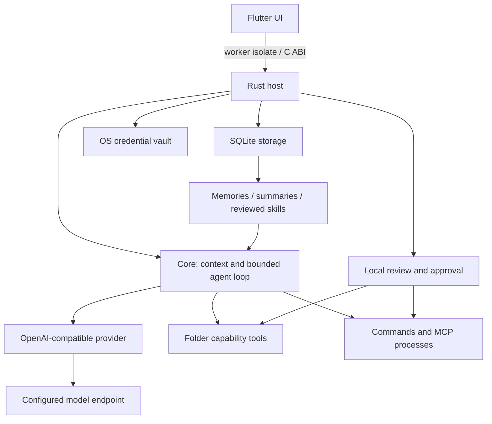

# Dolores architecture

Dolores is a local desktop harness. Flutter is the selected UI; a bundled Rust host assembles the core and provider/storage/credential/tool plugins. Memories and reviewed skills change request context, not model weights. Outcome evidence helps judge selected changes without claiming consciousness or general autonomous competence.

The normal Flutter entry point initializes `window_manager` before rendering.
`DesktopFrame` owns only themed window chrome and event-driven desktop controls
above the Navigator. The OS still owns window movement, resize, maximize and close;
an initialization failure falls back to the native frame. It adds no host tool,
model activity or background worker. Web/mobile and diagnostic entry points keep
their existing frame behavior; macOS keeps native traffic lights.

This document describes implemented behavior. The [evolving-harness specification](design/evolving-harness-architecture.md) and [behavior policy](design/dolores-behavior.md) describe the target architecture for [milestones 9–13](ROADMAP.md). Milestone 9's inspection, run ownership, registry and scoped settings are implemented; later adaptation/runtime contracts remain planned.

## Does the current architecture support self-evolution?

**It provides a reusable foundation, but not a self-evolving executable runtime.** Typed provider/storage/credential/tool ports, persisted knowledge, retained skill versions, approvals and recovery support inspection and controlled adaptation. A [shared registry](design/extension-registry.md) now describes compiled and MCP registrations, resolves dependencies and pins run versions. MCP contributes reviewed tools; context/agent/UI replacement is not loaded. There is no executable runtime loader, transactional hot activation or independently enforced generated-extension trial boundary.

The [run coordinator and durable evidence](design/run-ownership.md) bind cancellation/decisions to client IDs and primary chat evidence to durable IDs. One foreground execution remains the default; safe reads are available during execution and conflicting mutations refuse. [Bounded subagents](design/subagents.md) now run inside that owner's lifecycle with inherited permissions and shared limits. Saved drafts/checkpoints, managed thread recovery and text/image attachments are implemented. Existing literal tool-free comparisons cannot establish whole-task skill improvement; automatic learning currently means conservative preference extraction, not autonomous skill/mod updates.

Retain Flutter/Rust and existing data/ports. Add read-only introspection first, then durable run/lifecycle contracts, task evidence and independent evaluation, and finally a selected executable extension runtime. The [specification's gap table](design/evolving-harness-architecture.md#decision-and-architectural-fit) maps retained components to required refactors. Full user-account commands cannot physically protect the kernel through application policy alone; the target design preserves this distinction.

## Components

[Task permissions](design/task-permissions.md) now enforce explicit per-chat Review/Auto/Full access with typed resource grants, revisions, expiry and dispatch rechecks. Grant revocation cancels the owning primary run. Protected self-update policy remains separate; commands/MCP are still user-account execution.

Primary working runs use [scoped task budgets](design/task-budgets.md), retaining four-call/four-operation defaults while allowing explicit bounded overrides. Continue tracks the saved task's accumulated segments. Fixed synthetic files/checks evaluate actual outcomes; completed provider replies do not imply completed tasks.

`delegate_tasks` is a pinned compiled tool registration. A single batch of up to
two children gets disjoint writable file scopes, scoped file plugins and the
parent's model/approval policy. Child requests carry namespaced IDs. An atomic
shared counter reserves all model/tool attempts, leaving one parent reporting
call; the parent's deadline/cancellation owns the joined futures and serialized
approval queue. No new worker process or idle polling is added. Parent-linked
events retain reports, usage and bounded per-step commentary. Children cannot
invoke commands/MCP, change grants or recurse. The parent verifies their reports.

| Component | Responsibility |
| --- | --- |
| `apps/dolores_flutter` | System-theme widgets, editable rich draft, history and local inspectors. |
| `crates/dolores-flutter-bridge` | In-process C ABI, connection/review coordination, working-session assembly and bounded workers. |
| `crates/dolores-core` | Typed ports, context preparation, budgets, approvals and bounded chat/tool loop; no UI/HTTP/SQLite/keyring dependency. |
| `crates/dolores-provider-openai` | OpenAI-compatible discovery, streaming Chat Completions, tool-call assembly and reasoning adapters. |
| `crates/dolores-store-sqlite` | Transactional history, provenance, preferences, workspace associations and local evidence. |
| `crates/dolores-credentials` | OS vault keys scoped to the data directory, with no plaintext fallback. |
| `crates/dolores-tools-fs` | Directory-capability reads/discovery and separately approved exact edits/creations/journal actions. |
| `crates/dolores-tools-command` | Reviewed direct executable/arguments, bounded capture/deadline and owned process cleanup. |
| `crates/dolores-tools-mcp` | Reviewed local stdio catalogs, selected tools, credential resolution and on-demand process transport. |
| `crates/dolores-tools-web` | Setup-free Mwmbl search, configurable Brave/SearXNG and bounded public HTTPS page extraction. |
| `crates/dolores-tools-browser` | Pinned optional Playwright worker, one fresh visible browser per parent run, stale-state checks and owned cleanup. |

The [bridge contract](flutter/flutter-api.md) defines allocation ownership and command coordination. Native calls run off the UI isolate. The host uses two Tokio async workers and at most two blocking workers; command transport additionally uses bounded pipe readers while a process is active. Optional browser use owns one supervised transport thread and Node/browser process tree only during its parent run. No model, idle Node service, vector database, startup tool server, background scheduler or idle polling is bundled.

[Browser use](design/browser-use.md) registers only when the pinned optional
adapter and Node are discoverable. It shares the parent's budgets, approvals and
durable tool evidence, with fresh review required for clicks/input even under
Full access. Captures live in the local data directory and load on explicit
preview. The worker inherits only selected OS directory/display hints, never
model keys or Node startup options. Owned process groups/Job Objects control
lifetime rather than account authority. Browsers do not join delegated children.

Iced (`crates/dolores-native`) and Tauri/Svelte (`src-tauri`, `src`) remain development comparisons using shared core ports. They do not have full Flutter feature parity. Trusted built-in plugins are compiled and explicitly registered; there is no generic native dynamic-loader or plugin installation UI.

## Context and learning

Working chats pin the global [web connection](design/web-search.md) and two
optional compiled web tools. Their approved literal queries/URLs consume the
existing task allowance and retain attributable, untrusted results in run evidence.
No idle service, browser process or search key is needed for default Mwmbl.
Brave keys stay in the OS vault and are sent only to its fixed endpoint.
Public DNS is validated and pinned; routing-proxy synthetic addresses use a
disclosed bounded public DNS lookup without accepting private destinations.
The registration ceiling is twelve tools (eight built-ins, two selected MCP
tools and two web tools); execution budgets remain unchanged.

Milestone 10 adds [task budgets](design/task-budgets.md), [thread permissions](design/task-permissions.md), [durable recovery](design/task-checkpoints.md), [forks and managed context](design/managed-threads.md) and [attachment snapshots](design/attachments.md). Reviewed file patches can bind snapshots up to 1 MiB while diffs/model-facing results remain bounded. Commands have explicit deadline/capture settings and optional owned local logs; they remain outside the file journal. Attachments use backward-readable message parts, immutable local assets and an explicit text/image provider adapter, with bounded sharing and cleanup.

Primary chats resolve [scoped settings](design/scoped-settings.md) from model/user generation defaults, user interaction, project and chat overrides. Context preview and actual provider requests share this resolution; durable runs retain values and origins. Model reasoning/context windows stay in model configuration, with the existing 128K blank default. Behavior instructions encourage reasoning discussion, evidence-based questions and calm recovery; they cannot guarantee a model's conduct. Tool review, preference learning and future self-update authority remain distinct.

Brick 9.1 adds local capability inspection and a reviewed `inspect_harness` tool in working chats. The report excludes keys/private roots, labels model reliability unknown and exposes existing limits. A bounded six-component source bundle corresponds to the running code, including the subagent adapter; explicit checkout comparison never changes the source used for diagnosis. Build revision identifies checkout HEAD at compilation; bundled file identities capture local source differences. Neither source access nor the catalog grants self-update authority.

Each saved Project/Temporary chat has a working folder; Side chats have none. Temporary folders are created lazily. Associations are immutable per chat and do not follow the last visited folder. Folder roots are private host state, excluded from automatic model context/exports. Chat deletion preserves files.

Context combines host instructions, reviewed root/nested AGENTS.md guidance, bounded folder-first preferences, relevant activated skill snapshots, a saved session summary, attachments and recent uncovered turns. Exact prepared context is inspectable. Model-window estimates reserve output and headroom, including an approximate image allowance; provider-reported usage remains separate. Retrieval retains whole entries and does not erase history.

Automatic learning conservatively extracts eligible explicit durable preferences after successful unpaused replies, using quoted user evidence and an extra bounded tool-free request. Manual changes protect learned entries; inference/topic coverage remains limited. Manual summaries require review/Save; a chat can opt into one bounded preflight compaction when uncovered context is omitted. Skills use reviewed project/global snapshots, with same-name project precedence, retained versions and explicit activation/rollback. Generated skill promotion requires complete all-pass strict improvement on frozen literal tests; this does not establish general task quality.

Task feedback stays local and never becomes model/learning input. Context comparisons isolate two frozen instruction snapshots from chat history, other instructions and tools; each result is saved before the next call. Failed storage leaves a clearly volatile copy and earlier durable evidence. No automatic activation, retry or evaluation scheduler is added.

## Run lifecycle and recovery

One active foreground run is allowed per host; its scoped children share that ownership. Conflicting local mutations/configuration are excluded while it is active. Prepared complete tool calls enter a run-bound permission check; partial/malformed calls and model text cannot authorize operations. Review requires a fresh decision; Auto approval checks exact active grants, while Full access retains tool boundaries. Revocation and Stop remain available. Saved receipts are evidence, not executable instructions or reusable permissions.

Normal successful turns save text, original model/settings/context, usage and tool records atomically. Transport errors, malformed responses and Stop discard uncommitted chat content and retain a usable draft. Explicit output/step exhaustion can save a paused reply with completed progress; Continue binds the latest source at preparation/execution/commit and starts a separate bounded run. Failed/incomplete commands remain actionable until the same command completes successfully. No silent retry or unbounded continuation occurs.

File effects persist independently of replies. The change journal records raw snapshots, intent and receipts, including uncertain completion. Revert/removal require a separate one-use preview and exact current-byte match. Edits adapt proposal line endings only for uniform LF/CRLF files while preserving other characters and unique-match rules. Commands and MCP effects are outside the file journal.

## Trust and data

File tools use held folder capabilities and refuse disallowed paths/links. Commands and external MCP servers run with user-account permissions; they are not folder sandboxes. Selected stdio MCP servers start only for explicit inspection/approved invocation, negotiate bounded catalogs, recheck reviewed launch metadata and then stop. Four saved servers share two active external tool slots. Keys are resolved after binding checks, passed through reviewed environment names and redacted from known echoes.

The OS vault and SQLite are separate stores; native-vault cleanup is best effort with actionable recovery. SQLite history/preferences/change snapshots are unencrypted. `DOLORES_DATA_DIR` chooses an absolute data directory; keys are scoped to it. The Flutter host holds a cross-process data-directory lock, permitting one owner per data directory. See [privacy](PRIVACY.md).

## Current resource bounds

| Area | Bound / policy |
| --- | --- |
| Provider streaming | 32-item text queue, 1-MiB SSE frame, 128-KiB answer capture, 10-second connect timeout. |
| Generation | Default 2048 output tokens / 180 seconds; profiles allow 1–32768 tokens and 1–900 seconds. |
| Agent loop | Default four model calls / four tool operations shared by parent/children; explicit settings permit 2–16 calls / 1–32 operations. No automatic reset. |
| Subagents | One batch / up to two children / depth one; each at most four calls / four file operations, within the shared total and parent deadline. |
| Context | 16-KiB user message, latest 40 complete turns, 128-KiB text guard plus estimated model-window allowance. Blank configured capacity is 128K tokens. |
| File tools | 16-KiB file/diff limit; larger argument assembly is reserved for complete file proposals. |
| Commands | 30-second execution / 8-KiB combined output capture; subprocess memory is not a harness memory cap. |
| Comparisons | 1–3 tests / at most six sequential tool-free responses, each ≤2048 output tokens / 60 seconds / 8-KiB text; 30 receipts per chat. |
| Desktop history | One 50-session / 80-message page; full-history export is separate from provider context. |

HTTPS is required except HTTP loopback. Redirects are disabled. Fetching models, sending messages, requested drafts/comparisons and eligible automatic preference extraction can contact the provider; local settings/inspection do not. Polling exists only during active work.

The provisional 150-MiB idle working-set and two-second cold-start goals on a 2-core/4-GiB machine remain unaccepted. Earlier Flutter observations exceeded the memory target. See [acceptance](ACCEPTANCE.md) for measurements, executed scopes and platform/input gaps; do not turn a build or synthetic fixture into release acceptance.

## Build and release tooling

The normal Windows helper assembles Flutter/Rust/plugins with generated junctions where symlink privileges are unavailable. The regression runner is development tooling: selected isolated save/restart checks, stage deadlines, retained failure reports and explicit scope. Windows portable packaging accepts reviewed runtime paths, preserves assets/notices and adds hashes/user guidance; it is an unsigned local preview with separate prerequisites and release gates.

See [contributor guide](../CONTRIBUTING.md), [roadmap](ROADMAP.md), [design references](README.md#selected-design-references), and dated [architecture research](research/architecture-options.md) for implementation details/history and alternatives.

## Desktop settings presentation

Flutter uses one settings window with lazily created, retained editors and a shared pending-operation gate. The existing scoped settings, model profiles, memory, skills, MCP and permission ports remain authoritative. InspectorFrame embeds only on its Settings route; nested reviews retain their own dialog boundary. Models unifies connection/capabilities/context, responses and project/chat generation overrides. Scoped editors preserve other patch groups and retain compare-and-swap revisions. Theme is a separate typed local appearance preference, persisted in an additive schema-27 singleton and returned by bootstrap; it is never included in model context or grants. SaveAppearance is independent of active generation.
