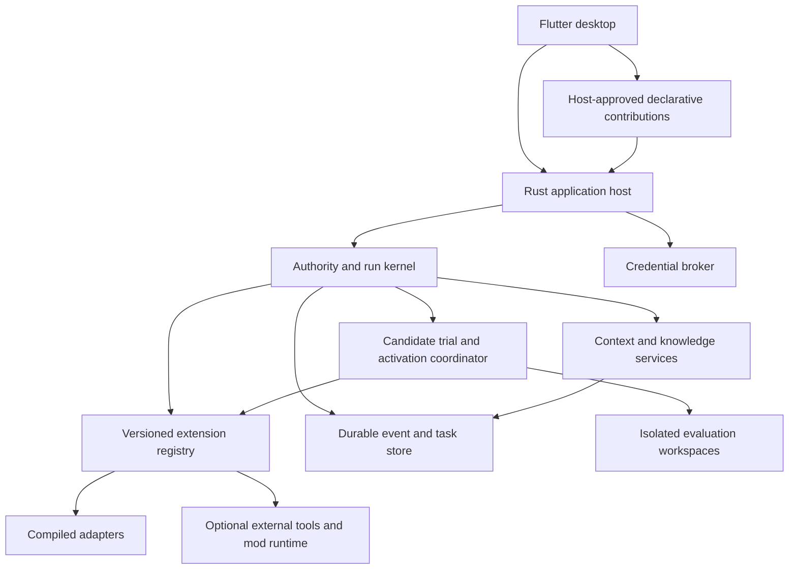

# Architecture specification for an evolving Dolores

Date: 2026-10-04. Status: planning baseline requested by the user; target contracts, not implemented behavior. [Current architecture](../ARCHITECTURE.md) remains the description of the running app. Implementation follows the [roadmap](../ROADMAP.md), with actual evidence in [acceptance](../ACCEPTANCE.md).

## Decision and architectural fit

Retain Flutter for the desktop and Rust for the host/core. Evolve the existing ports and stores incrementally. A rewrite is not required. At this specification's original baseline, persistent preferences, reviewed/versioned skills and compiled adapters existed, but an executable adaptation runtime did not. Milestones 9–13 have since delivered the narrow [recovery-mod envelope](executable-mods.md); see [current architecture](../ARCHITECTURE.md) and [acceptance](../ACCEPTANCE.md) for implemented behavior and remaining gaps. Being able to edit source files is not equivalent to safely activating a new running implementation.

The following table records the original foundations and refactor plan, not a
claim that every listed gap is still open.

| Existing foundation | Reuse | Gap to close |
| --- | --- | --- |
| ModelProvider, SessionStore, CredentialStore and ToolPlugin ports | Provider independence, typed tool preparation, storage/vault separation | Common capability inventory, lifecycle, version negotiation and host-owned extension authority |
| Flutter C ABI host, worker isolates and bounded queues | Responsive desktop and shared Rust runtime | One host-wide active slot/global mutation exclusion must become thread/run ownership and scoped conflicts |
| SQLite sessions, context provenance, summaries, paused replies and change receipts | Preserve history and inspect prior work | Durable run/event identity, checkpoints, thread forks and crash reconciliation |
| Preference extraction, global/project skills and retained versions | Scoped continuity and recoverable instruction changes | Experience attribution, task-level evaluation and policy-controlled automatic activation |
| Local feedback and frozen literal comparisons | Immutable evidence and candidate/baseline separation | Feedback currently stays out of learning; opt-in evidence use and tool-using trials need new contracts |
| Compiled tools and reviewed stdio MCP | Existing working capabilities and lazy external processes | MCP transports external tools; it is not an internal context/loop/UI mod API |
| Text Message content | Preserve existing conversations through adapters | Versioned content parts and attachment lifecycle for multimodal input |

Evidence anchors: [core ports](../../crates/dolores-core/src/lib.rs), [tool/approval ports](../../crates/dolores-core/src/agent.rs), [Flutter host](../../crates/dolores-flutter-bridge/src/lib.rs), [skill contract](project-skills.md), [comparison boundary](context-comparisons.md) and [feedback boundary](task-feedback.md). These are structural observations, not runtime reliability or security acceptance.

## Goals and exclusions

Deliver a provider-independent desktop agent that completes useful project work, questions consequential mistakes, preserves continuity and improves supported workflows from evidence. Support automatic activation of changes with limited impact after tests, with rollback; discuss reasoning before most implementation work. Use the [behavior policy](dolores-behavior.md) throughout.

No model-weight training, consciousness claim, guarantee of daily improvement, silent authority escalation, unbounded retry/reflection, arbitrary native hot swapping, or marketplace is part of this baseline. Cross-platform architecture is required; platform CI brick 8.4 remains skipped. Actual OS containment and portable runtime compatibility require separate acceptance.

## Components and dependency direction

The core owns data contracts and policy-independent algorithms, not Flutter, HTTP, SQLite or runtime-engine dependencies. The host composes adapters and routes C ABI commands/events. Storage, provider, tools, context selection and learning strategies use typed ports. The kernel authorizes actions proposed by those components. The evolution coordinator consumes evidence and proposes replacements; it cannot modify its own authority or acceptance rules.

Start as modules in the existing crates, splitting crates only where independent ownership/dependency boundaries justify it. Do not introduce a service process for each box. Preserve system theme and composition behavior under the [UI contract](../UI.md); future extensions contribute through approved surfaces rather than arbitrary desktop mutation.

## Authority contract

Separate three controls:

1. **Task approval:** review each operation, automatically approve operations covered by a user grant, or opt into full-access execution.
2. **Execution containment:** the actual filesystem/process/network boundary supported by an adapter and OS. Approval policy does not create this boundary.
3. **Self-update authority:** which candidate types/scopes may activate automatically. Full-access tasks do not imply full self-update authority.

A grant binds user choice, project/thread scope, tool/capability, resource constraints, expiry/revision and revocation. Effective child permissions are an intersection of parent grants, child scope and host rules; a child cannot expand them. Recheck grant revision at dispatch. A tool, skill, retrieved page or generated mod cannot confer authorization.

Keep grant enforcement, credentials, hard ceilings, cancellation, durable evidence integrity, loader decisions and evaluator configuration outside agent-replaceable hooks. Extension transformations run before final host validation. Denial/error in a policy-critical path refuses the action; it must not fall through to execution. Prompt restrictions alone are not enforcement.

Initial automatic activation is project/thread scoped, within an existing capability envelope, without new dependencies, permissions, secret access, destructive migration or unreviewed external trial effects. Global activation needs a separate explicit user policy because it affects other projects. The host compares manifests/diffs and conservatively escalates uncertainty to review. It cannot prove arbitrary instruction text harmless.

Strong physical protection is unresolved until OS controls are implemented and verified. Full user-account commands/MCP can bypass application-only filesystem restrictions. With that mode, the UI must describe the protected kernel as a managed update boundary, not an untouchable security sandbox. Capability-mediated candidate execution must not be called isolated merely because it uses another process.

## Capability inventory and source inspection

Inventory entries include stable identifier, execution kind, implementation/version/API range, enabled state, availability reason, required/effective capabilities, config revision, health and evidence references. Represent installed, enabled, permitted and empirically exercised separately. Model-visible output omits credentials and private absolute roots; explicit source retrieval applies normal sharing rules.

Provide a read-only inspect capability, then a bounded source-read capability. Source references bind build identifier/commit or content digest and relative path. A development checkout that differs from the running build is reported as a mismatch. Missing source is actionable, not replaced with an invented description. Packaged builds can use a version-matched source bundle or user-selected matching checkout. Do not fetch/upload the whole repository implicitly.

Inventory includes effective model modalities/tool support, context capacity, generation/task budgets and their origins. Discovery is not proof of successful execution. Self-diagnosis records observations and confidence rather than claiming that access to source confers complete understanding.

## Thread, run and evidence contract

Use stable ProjectId, ThreadId, RunId, parent RunId and EventId. A thread owns workspace association, durable conversation, task state and chosen configuration revisions. A run captures model/settings, grants, context provenance and extension versions at preparation. In-flight changes do not silently alter that snapshot; revocation and host emergency cancellation still apply immediately.

Run states: prepared, running, waitingForApproval, paused, completed, failed, cancelled and interrupted. Waiting is visible and subject to an explicit timeout policy. Progress/task plan is distinct from verified completion. Terminal or paused state records reason, completed/uncertain effects, usage and available next action. Continue creates a linked bounded segment, not an unlimited reset of task allowances.

Replace the global active slot with a run coordinator. Initially retain one active execution by default while making ownership per-thread; later enable bounded children/concurrency. Configuration updates use revision comparisons. Per-project writes/activation have explicit leases/conflict checks; same-file parallel edits bind snapshots. The UI may inspect/switch threads while an unrelated run progresses, but cannot submit contradictory mutations silently.

Append versioned events for preparation, selected context, model steps, tool decisions/results, effect intent/receipt, checkpoints, run outcomes and candidate activation. Assign monotonic sequence per run and durable IDs. State tables can be projections of events while old chat tables remain readable. Persist intent before an effect, then receipt; after a crash mark unresolved intent uncertain. Do not automatically replay side-effecting work.

Event delivery to Flutter is bounded and cancellable. Durable events can be fetched after reconnect; ephemeral text deltas are bounded separately. A full UI queue must not suspend cancellation or deadlines. Store operation IDs can deduplicate records, but do not assert exactly-once command/network effects. Process ownership and data-directory locking must be specified; separate app instances must not race migrations/activations.

Fork copies selected durable conversation/task provenance into a new thread and records the origin. It does not clone working files, grants or active child runs. The user sees whether the fork shares the working folder; Git worktree/file-copy isolation is a later explicit feature. Deleting a thread must preserve user working files and reconcile retained evidence references under an explicit retention policy.

## Context and attachments

Context preparation receives task state, messages/content parts, guidance, selected knowledge/skills, model capabilities and limits. It returns a bounded manifest of selected sources/versions, omissions, estimates and reserved output. Host invariants apply after any extension transformation. Preserve configured per-model context windows and the 128K blank default; reported usage and estimates retain distinct labels.

Managed compaction operates on complete event/turn boundaries. Summary coverage binds source revisions and unresolved goals/effects. Keep the original transcript; summaries are derived context, not replacement history or authorization. Pin the previous valid context until the new summary is stored. Failed/oversized summaries preserve work and offer bounded manual recovery. A tool result still too large needs ranged retrieval/artifact references, not endless compaction.

Discover scoped ancestor/nested guidance and relevant activated global/project skills with visible precedence and content revisions. Reviewed activation remains distinct from discovery. Retrieved files/pages/tool output are quoted data, not host instruction or grants.

Introduce a backward-readable content-parts schema: text plus attachment references with kind, content digest, MIME, size and display metadata. Copy user-selected attachments into bounded local storage at selection or bind a checked snapshot; do not rely on a mutable original path. Preview actual provider sharing. Text files enter bounded text/artifact paths; images require declared provider modality or an explicitly configured vision/OCR adapter. Unsupported inputs remain in the draft with a useful next step. Recheck attachment existence/digest before send; define export, retention, deletion and orphan cleanup. Refuse unsupported binary decoding and excessive payloads without losing the draft.

## Settings and budgets

Effective settings resolve user defaults, project overrides and explicit thread overrides with origin shown. Snapshot them into a run; later changes affect future runs. Permission overrides cannot expand authority without user action. Include model windows/output/timeouts, task/continuation allowances, tool deadlines/capture, concurrency, attachments, context policy, tone, learning and self-update settings. Validate before saving; preserve the previous valid config on failure.

Use separate bounded budgets for foreground tasks, child tasks, compaction and reflection/trials. Track model calls, tool operations, elapsed deadlines, provider-reported/estimated token usage and applicable process/runtime resource limits. Children spend from parent totals as well as their own caps. Never silently raise ceilings or switch to a more expensive model. Unknown pricing/usage stays unknown. Choose new defaults from measured tasks, not assumed competence.

No resident browser, vector store, indexer, model server or daily reflection worker by default. Lazy services release owned resources after use. Pin only necessary active state; paginate history/evidence. Measure idle/startup and active parent-plus-child costs separately from user-hosted models. Keep provisional low-end targets unaccepted until representative measurements.

## Extension contract and activation lifecycle

Normalize compiled adapters, MCP tools, declarative policies/skills and future executable mods under a shared inventory, while retaining their different trust/execution kinds. A plugin name does not confer compatibility or isolation. Avoid Rust ABI dynamic loading in this baseline.

Proposed descriptor fields: identifier/version, host API range, kind, declared hooks/tools/UI contributions, dependencies, capability requests, config/state schema versions, entry digest and resource limits. Configuration and candidate identity are immutable snapshots. Registry resolves dependencies and deterministic hook order, rejects unsupported APIs/cycles and reports disabled/unavailable entries without breaking ordinary chat.

Lifecycle: discovered → validated → staged → trialled → eligible/reviewRequired/rejected → pendingActivation → active → retired/quarantined. Each registration owns its tools/listeners/tasks and cleanup. Side-effecting calls remain host-routed. Hooks have typed inputs/outputs, cancellation/deadline and bounded result sizes; unsupported replacement of host authority is refused.

Runs pin versions. Activation waits until affected runs finish/pause and resource handles are quiescent; an unrelated project need not stop. Write a durable activation intent containing old/new identities, expected revisions and recovery pointers. Then atomically change the registry pointer/state transaction and record the receipt. Restart reconciles incomplete transitions before executing candidates. Failed validation/loading/health checks leave or restore the last working version. Rollback cancels owned candidate work and restores designed state/config; it cannot undo arbitrary external effects.

State migrations are explicit and tested against a copy. Automatic changes cannot perform destructive/unrecoverable migrations. Bound retained versions and preserve any versions pinned by runs/evidence until their retention references end. Disable/quarantine is immediate for new runs; already executing effects are cancelled where possible and honestly reported if uncertain.

Flutter release UI accepts declarative contributions such as supported inspector cards/actions with host-resolved handlers. Agent content cannot create arbitrary permission controls or execute injected Dart/HTML. Arbitrary native UI/kernel patches use the ordinary reviewed build/restart path. Flutter development hot reload is not the production extension mechanism.

## Executable runtime selection gate

Choose the first executable mod runtime only after a bounded comparison. Compare capability-limited embedded scripting, Wasm with restricted imports, and restricted worker execution on supported OSs. Measure release size, idle/startup overhead, active memory/CPU, cancellation, filesystem/network/process access, dependency packaging, portability, state handling and diagnostic quality. Use synthetic valid, runaway and malformed modules. Do not choose an engine because it supports hot reload while ignoring containment.

The gate must yield either a concrete engine/ABI/capability/resource contract or a documented deferral to declarative extensions. In-process trusted built-ins remain distinct from agent-generated code. Trial runs without verified containment use deterministic fixtures/no secrets and require review for wider execution; they cannot qualify for unrestricted automatic activation. Kernel/native patch generation can produce reviewable diffs but is excluded from automatic live activation.

## Evolution and evidence

Trigger bounded reflection after meaningful failure, repeated friction, explicit correction or verified reusable success. No obligation to change daily. Deduplicate triggers, use separate allowances and allow learning pause/disable. Store minimal relevant evidence and distinguish user outcome assessment, command/file receipts and model claims.

Classify causes: incorrect premise, stale skill, missing context, model reasoning, tool/provider failure, harness limit or unknown. Do not rewrite a skill to evade a hard limit. Evidence use respects current privacy boundaries: feedback notes are not silently sent to a provider; a new opt-in policy must describe eligible sources and sharing before using them for learning.

Candidate identity binds source versions/digests, reason, proposed scope, model/settings, declared impact, frozen criteria and trial evidence. Use isolated versioned project fixtures with mocked external effects and observable file/check outcomes. Keep baseline/candidate settings and allowances equal, plus independent regression/held-out cases. Literal responses alone cannot justify workflow activation. An unfinished trial, ambiguous result, failed storage or a tie does not establish improvement.

Host eligibility checks exact candidate bytes, active baseline revision, grants, evaluator revision and complete stored evidence at activation. Changed sources/settings invalidate prior eligibility. Candidate cannot edit the evaluator or choose a passing score. Tests supply bounded evidence, not a guarantee that natural-language skills are safe or generally superior. Ambiguous impact requires review.

Automatic eligible activation follows the selected policy and leaves a user-readable change notice/reason, evidence and rollback action. Preserve manual corrections/disabled items. Later failures can quarantine/revert a candidate; diagnosis distinguishes unrelated model/provider failures. User can inspect, decline further adaptation or restore a version. Broader/global changes require the relevant explicit policy.

## Advanced tool contracts

Subagents get explicit goals, parent run, ownership and capability/budget subsets. Parent cancellation reaches children and owned processes. Results include evidence/status, not just prose. Concurrent writes conflict instead of silently overwriting. No unbounded recursive spawning or detached background children.

Search is an optional provider/tool with source URLs, bounded requests and attributable results. Browser sessions start on demand, identify the selected page/profile, expose bounded screenshots/state, and release owned sessions. Persistent authenticated profiles and consequential external actions require explicit user choices. Retrieved instructions cannot change grants. Exhaustion/unavailable tools preserve task state and offer another approved route.

## Migration and verification strategy

1. Add read-only inventory/build-source identity using existing descriptors; no executable loader required.
2. Add versioned event/run tables and scoped coordination while retaining current defaults and legacy readers.
3. Adapt built-ins/MCP into registry contracts; introduce effective settings and behavior provenance.
4. Extend task/context/permission/message flows without rewriting old history or losing pending work.
5. Build task evidence and evaluations before automatic skill activation.
6. Add a chosen executable runtime and transactional activation only after the runtime gate.

Every data migration is additive where possible, transactional, restart-tested and backed by a recoverable schema/version strategy. Existing preferences/skills retain their provenance/manual-protection semantics. Legacy evidence lacks new fields honestly; do not fabricate receipts. Do not expose vault values or private transcripts in public fixtures, diagnostics or source bundles.

Per-brick acceptance is specified in the roadmap: basic flow plus realistic failure/recovery cases, deterministic injection and bounded Qwen routine/DeepSeek harder probes when model behavior matters. Record results and gaps. Match verification to the change: document/link checks for documentation, focused runtime tests and a normal build when compilation/packaging is affected. There is no required launch or visual check after every task. Prefer saved renders inspected with `view_image` for UI appearance; use computer-use when interaction/native behavior needs it, and launch for relevant integration checks or user-requested previews. Preserve configuration/history. CI, cross-platform behavior and strong isolation remain separately named gates rather than being inferred from Windows fixtures.

## Outstanding design gates

Decided: Flutter/Rust, inspectable code, reasoning discussion before most implementation, tested automatic activation with rollback for limited-impact changes, fixed host authority, incremental migration. Implementation must close these gates at their assigned bricks:

- Measured task/concurrency/reflection defaults and representative resource targets.
- Exact grants for auto approval/full access and OS containment claims.
- Executable runtime and supported platform capability enforcement.
- Task evaluator criteria/corpus and conservative low-risk eligibility rules.
- Global update scope, attachment retention, source bundle distribution and extension state migrations.

Changing a gate or adding scope requires a roadmap/spec revision before implementation, with rationale and acceptance consequences. This keeps the roadmap planned while allowing evidence to correct a technical assumption.

## References

The [vision discussion](dolores-vision-discussion.md) records user intent and the [primary-source comparison](../research/evolving-harnesses.md) separates DSH/Claude facts from design inferences. DSH supplies capability/lifecycle composition precedent; Claude Mods supply event interception and turn-boundary reload precedent. Neither establishes safe autonomous general improvement. Codex thread lifecycle informs durable context/fork/compaction semantics without requiring an OpenAI backend. This specification is a Dolores design, not a promise of compatibility with those systems.
